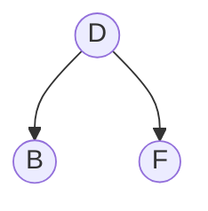

# My blog

This blog was largerly motivated by  <a href="https://karpathy.ai/" style= " text-decoration: none;"> Andrej Karpathy </a> and a personal professor at the University of Illinois at Urbana-Champaign <a href="https://jeffe.cs.illinois.edu/" style= "text-decoration: none;"> Jeff Erickson</a>. , uses [Jekyll](http://jekyllrb.com/). 

<!-- test locally  bundle exec jekyll serve --livereload -->

## Mermaid diagrams

Use a fenced `mermaid` block in any Markdown post or page using the site's layouts:

````markdown

````

No front matter flag is required. Diagrams render in the browser using Mermaid
from jsDelivr, loaded only on pages containing Mermaid blocks. If loading or
rendering fails, the original code remains visible.

See the [Mermaid documentation](https://mermaid.js.org/intro/) for diagram syntax.
