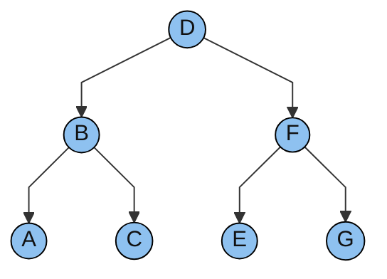

Splay trees are self-adjusting binary search trees that move an accessed node to the root through a sequence of rotations called splaying. In this post, I will explore how the zig, zig-zig, and zig-zag steps work, how splaying supports search, insertion, and deletion, and why these operations take amortized logarithmic time even though a single operation can take linear time.

I will to go over some topics involving splay trees including the following **Static optimality**, **Splay Trees**, **properties of splay trees**, and **dynamic optimality**.

### Static Optimality

Balanced BSTs guarantee worst case \\( O(\log{n}) \\) operations. Sometimes the way the bst is queried will not be an optimal BSTs.

Given \\( S = \\{ x_1, x_2, \dots, x_n \\} \\) be a set with access probabilities \\(p_1, p_2, \dots, p_n\\).

Then \\(T^{\star}\\) is a called a **statically optimal binary search tree**

